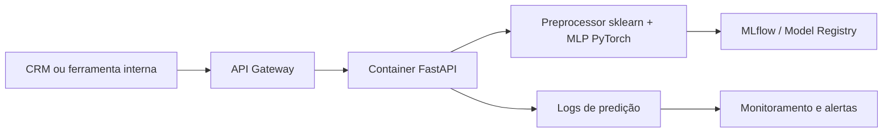

# Arquitetura de Deploy

## Decisão

O deploy em nuvem ainda não foi executado. Este documento registra a arquitetura recomendada para
uma implantação operacional da API de churn.

## Opção Recomendada: Inferência Real-Time

A API FastAPI já implementada favorece consumo real-time por CRM, dashboard interno ou ferramenta
do time de retenção.



Serviços possíveis:

- Google Cloud Run.
- AWS App Runner ou ECS Fargate.
- Azure Container Apps.

Vantagens:

- Baixa latência.
- Integração simples com sistemas internos.
- Permite threshold dinâmico por request.

Cuidados:

- Configurar limites de payload.
- Não logar dados sensíveis.
- Usar probes em `/health`.
- Versionar imagem e artefatos do modelo.

## Alternativa: Inferência Batch

Um job diário pode escorar todos os clientes ativos e gravar a lista priorizada em tabela ou CRM.

Vantagens:

- Menor custo operacional.
- Mais simples para campanhas diárias.
- Menor pressão de latência.

Desvantagens:

- Menor frescor da informação.
- Não atende casos de decisão interativa.

## CI/CD Sugerido

1. Rodar `make check`.
2. Construir imagem Docker.
3. Publicar imagem em registry.
4. Implantar em Cloud Run/App Runner/Container Apps.
5. Executar smoke test em `/health` e `/predict`.

## Execução com Docker

O repositório possui `Dockerfile` para servir a API FastAPI em container. A imagem usa Python 3.13,
instala o pacote local via `pyproject.toml`, executa Uvicorn sem modo reload e expõe a porta `8000`.

```bash
docker build -t tech-challenge-churn:latest .
docker run -d --restart unless-stopped -p 8000:8000 --name tech-challenge-churn tech-challenge-churn:latest
```

Os artefatos `models/mlp` são incluídos quando existem localmente no momento do build. Em ambientes
em que o modelo treinado é provisionado fora da imagem, montar o diretório de artefatos:

```bash
docker run -d --restart unless-stopped -p 8000:8000 \
  -v "$PWD/models:/app/models" \
  --name tech-challenge-churn \
  tech-challenge-churn:latest
```

## Recomendação Final

Para um MVP operacional, começar com batch se a campanha for diária. Para integração com CRM ou
atendimento em tempo real, usar a API real-time documentada acima.
